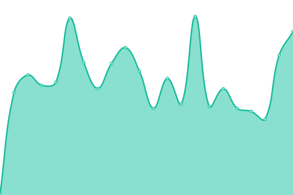
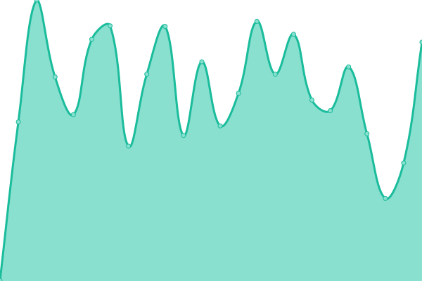

# [📈 Live Status](https://Maryville-University-DLX.github.io/saints-status): <!--live status--> **🟩 All systems operational**

This repository contains the open-source uptime monitor and status page for [Maryville University of St. Louis](https://www.maryville.edu), powered by [Upptime](https://github.com/upptime/upptime).

With [Upptime](https://upptime.js.org), you can get your own unlimited and free uptime monitor and status page, powered entirely by a GitHub repository. We use [Issues](https://github.com/Maryville-University-DLX/saints-status/issues) as incident reports, [Actions](https://github.com/Maryville-University-DLX/saints-status/actions) as uptime monitors, and [Pages](https://Maryville-University-DLX.github.io/saints-status) for the status page.

<!--start: status pages-->
<!-- This summary is generated by Upptime (https://github.com/upptime/upptime) -->
<!-- Do not edit this manually, your changes will be overwritten -->
<!-- prettier-ignore -->
| URL | Status | History | Response Time | Uptime |
| --- | ------ | ------- | ------------- | ------ |
|  [Canvas LMS](https://maryville.instructure.com) | 🟩 Up | [canvas-lms.yml](https://github.com/Maryville-University-DLX/saints-status/commits/HEAD/history/canvas-lms.yml) | 

 351ms
     
 | 

<a href="https://Maryville-University-DLX.github.io/saints-status/history/canvas-lms">100.00%</a>
    

|  [Maryville.edu](https://www.maryville.edu) | 🟩 Up | [maryville-edu.yml](https://github.com/Maryville-University-DLX/saints-status/commits/HEAD/history/maryville-edu.yml) | 

 280ms
     
 | 

<a href="https://Maryville-University-DLX.github.io/saints-status/history/maryville-edu">100.00%</a>
    

|  [Simple Syllabus](https://maryville.simplesyllabus.com/) | 🟩 Up | [simple-syllabus.yml](https://github.com/Maryville-University-DLX/saints-status/commits/HEAD/history/simple-syllabus.yml) | 

 871ms
     
 | 

<a href="https://Maryville-University-DLX.github.io/saints-status/history/simple-syllabus">100.00%</a>
    

|  [Zoom](https://maryvilleu.zoom.us/) | 🟩 Up | [zoom.yml](https://github.com/Maryville-University-DLX/saints-status/commits/HEAD/history/zoom.yml) | 

 162ms
     
 | 

<a href="https://Maryville-University-DLX.github.io/saints-status/history/zoom">100.00%</a>
    

|  [Self Service](https://selfservice.maryville.edu/Student) | 🟩 Up | [self-service.yml](https://github.com/Maryville-University-DLX/saints-status/commits/HEAD/history/self-service.yml) | 

 323ms
     
 | 

<a href="https://Maryville-University-DLX.github.io/saints-status/history/self-service">100.00%</a>
    

|  [Slack](https://maryville.enterprise.slack.com) | 🟩 Up | [slack.yml](https://github.com/Maryville-University-DLX/saints-status/commits/HEAD/history/slack.yml) | 

 224ms
     
 | 

<a href="https://Maryville-University-DLX.github.io/saints-status/history/slack">100.00%</a>
    

|  [Kaltura](https://maryville.mediaspace.kaltura.com/) | 🟩 Up | [kaltura.yml](https://github.com/Maryville-University-DLX/saints-status/commits/HEAD/history/kaltura.yml) | 

 938ms
     
 | 

<a href="https://Maryville-University-DLX.github.io/saints-status/history/kaltura">100.00%</a>
    

|  [Okta](https://launch.maryville.edu) | 🟩 Up | [okta.yml](https://github.com/Maryville-University-DLX/saints-status/commits/HEAD/history/okta.yml) | 

 479ms
     
 | 

<a href="https://Maryville-University-DLX.github.io/saints-status/history/okta">100.00%</a>
    

|  [Tutor.com](https://leo.tutor.com/) | 🟩 Up | [tutor-com.yml](https://github.com/Maryville-University-DLX/saints-status/commits/HEAD/history/tutor-com.yml) | 

 181ms
     
 | 

<a href="https://Maryville-University-DLX.github.io/saints-status/history/tutor-com">100.00%</a>
    

|  [Grammarly](https://app.grammarly.com/) | 🟩 Up | [grammarly.yml](https://github.com/Maryville-University-DLX/saints-status/commits/HEAD/history/grammarly.yml) | 

 362ms
     
 | 

<a href="https://Maryville-University-DLX.github.io/saints-status/history/grammarly">100.00%</a>
    

|  [LinkedIn Learning](https://www.linkedin.com/learning/) | 🟩 Up | [linked-in-learning.yml](https://github.com/Maryville-University-DLX/saints-status/commits/HEAD/history/linked-in-learning.yml) | 

 544ms
     
 | 

<a href="https://Maryville-University-DLX.github.io/saints-status/history/linked-in-learning">100.00%</a>
    

|  [You](https://you.com/) | 🟩 Up | [you.yml](https://github.com/Maryville-University-DLX/saints-status/commits/HEAD/history/you.yml) | 

 274ms
     
 | 

<a href="https://Maryville-University-DLX.github.io/saints-status/history/you">99.84%</a>
    

|  [Qualtrics](https://maryville.pdx1.qualtrics.com/) | 🟩 Up | [qualtrics.yml](https://github.com/Maryville-University-DLX/saints-status/commits/HEAD/history/qualtrics.yml) | 

 638ms
     
 | 

<a href="https://Maryville-University-DLX.github.io/saints-status/history/qualtrics">100.00%</a>
    

|  [MS Office](https://www.office365.com/) | 🟩 Up | [ms-office.yml](https://github.com/Maryville-University-DLX/saints-status/commits/HEAD/history/ms-office.yml) | 

 812ms
     
 | 

<a href="https://Maryville-University-DLX.github.io/saints-status/history/ms-office">99.82%</a>
    

<!--end: status pages-->

[**Visit our status website →**](https://Maryville-University-DLX.github.io/saints-status)

## 📄 License

- Powered by: [Upptime](https://github.com/upptime/upptime)
- Code: [MIT](./LICENSE) © [Anand Chowdhary](https://anandchowdhary.com), supported by [Pabio](https://pabio.com)
- Data in the `./history` directory: [Open Database License](https://opendatacommons.org/licenses/odbl/1-0/)
