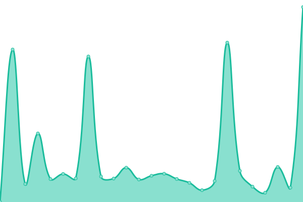
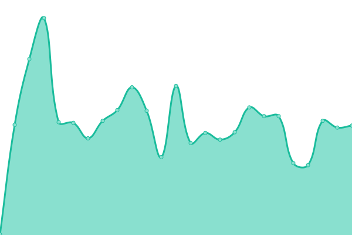

# [📈 Live Status](https://Maryville-University-DLX.github.io/saints-status): <!--live status--> **🟧 Partial outage**

This repository contains the open-source uptime monitor and status page for [Maryville University of St. Louis](https://www.maryville.edu), powered by [Upptime](https://github.com/upptime/upptime).

With [Upptime](https://upptime.js.org), you can get your own unlimited and free uptime monitor and status page, powered entirely by a GitHub repository. We use [Issues](https://github.com/Maryville-University-DLX/saints-status/issues) as incident reports, [Actions](https://github.com/Maryville-University-DLX/saints-status/actions) as uptime monitors, and [Pages](https://Maryville-University-DLX.github.io/saints-status) for the status page.

<!--start: status pages-->
<!-- This summary is generated by Upptime (https://github.com/upptime/upptime) -->
<!-- Do not edit this manually, your changes will be overwritten -->
<!-- prettier-ignore -->
| URL | Status | History | Response Time | Uptime |
| --- | ------ | ------- | ------------- | ------ |
|  [Canvas LMS](https://maryville.instructure.com) | 🟩 Up | [canvas-lms.yml](https://github.com/Maryville-University-DLX/saints-status/commits/HEAD/history/canvas-lms.yml) | 

 389ms
     
 | 

<a href="https://Maryville-University-DLX.github.io/saints-status/history/canvas-lms">100.00%</a>
    

|  [Maryville.edu](https://www.maryville.edu) | 🟩 Up | [maryville-edu.yml](https://github.com/Maryville-University-DLX/saints-status/commits/HEAD/history/maryville-edu.yml) | 

 844ms
     
 | 

<a href="https://Maryville-University-DLX.github.io/saints-status/history/maryville-edu">100.00%</a>
    

|  [Simple Syllabus](https://maryville.simplesyllabus.com/) | 🟩 Up | [simple-syllabus.yml](https://github.com/Maryville-University-DLX/saints-status/commits/HEAD/history/simple-syllabus.yml) | 

 762ms
     
 | 

<a href="https://Maryville-University-DLX.github.io/saints-status/history/simple-syllabus">100.00%</a>
    

|  [Zoom](https://maryvilleu.zoom.us/) | 🟩 Up | [zoom.yml](https://github.com/Maryville-University-DLX/saints-status/commits/HEAD/history/zoom.yml) | 

 213ms
     
 | 

<a href="https://Maryville-University-DLX.github.io/saints-status/history/zoom">100.00%</a>
    

|  [Self Service](https://selfservice.maryville.edu/Student) | 🟩 Up | [self-service.yml](https://github.com/Maryville-University-DLX/saints-status/commits/HEAD/history/self-service.yml) | 

 159ms
     
 | 

<a href="https://Maryville-University-DLX.github.io/saints-status/history/self-service">100.00%</a>
    

|  [Colleague](https://ui5.maryville.edu/) | 🟥 Down | [colleague.yml](https://github.com/Maryville-University-DLX/saints-status/commits/HEAD/history/colleague.yml) | 

 0ms
     
 | 

<a href="https://Maryville-University-DLX.github.io/saints-status/history/colleague">3.97%</a>
    

<!--end: status pages-->

[**Visit our status website →**](https://Maryville-University-DLX.github.io/saints-status)

## 📄 License

- Powered by: [Upptime](https://github.com/upptime/upptime)
- Code: [MIT](./LICENSE) © [Anand Chowdhary](https://anandchowdhary.com), supported by [Pabio](https://pabio.com)
- Data in the `./history` directory: [Open Database License](https://opendatacommons.org/licenses/odbl/1-0/)
